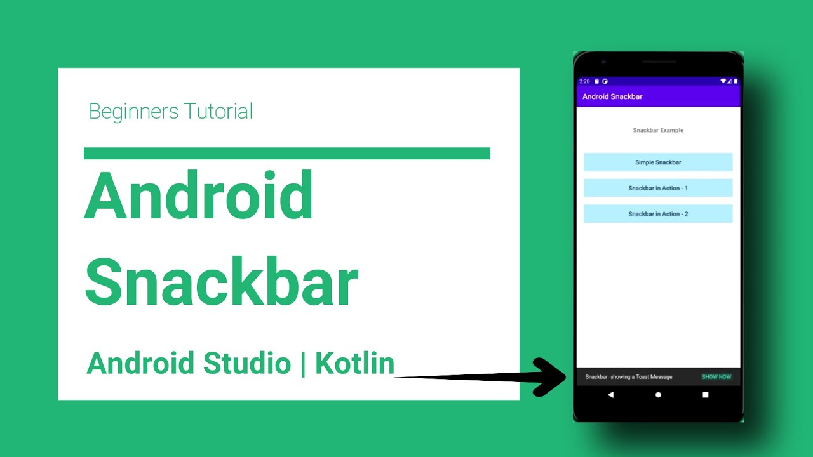

# AppRender

1. MainActivityView
2. DisplayRotationHelper
3. BackgroundRenderer
4. PointCloudRender
5. LabelRender
6. MLKitObjectDetector
7. GoogleCloudVisionDetector
8. ObjectDetector

 
 

# 1. MainActivityView 

Wraps **R.layout.activity_main** and controls lifecycle operations for **GLSurfaceView**. One of the Observer to the $MainActivity$.

Wraps means get a value for XML resources.

Controls Lifecycle of GLSurfaceView, because GLSurfaceView must be notified when to pause and resume rendering.

## Structure

1. getting it properties
2. lifecycle functions, onPause() and onResume()
3. post function - add this action/ to UI thread
4. setScanningActive - Toggles the scan button depending on if scanning is in progress.

## C - GLSurfaceView

An implementation of SurfaceView that uses the dedicated surface for displaying OpenGL rendering.

A GLSurfaceView provides the following features:

* Manages a surface, which is a special piece of memory that can be composited into the Android view system.
* Manages an EGL display, which enables OpenGL to render into a surface.
* Accepts a user-provided Renderer object that does the actual rendering.
* Renders on a dedicated thread to decouple rendering performance from the UI thread.
* Supports both on-demand and continuous rendering.
* Optionally wraps, traces, and/or error-checks the renderer's OpenGL calls.

### Activity Life-cycle

A GLSurfaceView must be notified when to pause and resume rendering. GLSurfaceView clients are required to call onPause() when the activity stops and onResume() when the activity starts. These calls allow GLSurfaceView to pause and resume the rendering thread, and also allow GLSurfaceView to release and recreate the OpenGL display.

## `post()`

Causes the Runnable to be added to the message queue. The runnable will be run on the user interface thread.

Params:
* action – The Runnable that will be executed.
* 
Returns:
* true if the Runnable was successfully placed in to the message queue.
* false on failure, usually because the looper processing the message queue is exiting.

 
 

# MainActivityView references

## L - OpenGL

Android includes support for high performance 2D and 3D graphics with the Open Graphics Library (OpenGL®), specifically, the OpenGL ES API. OpenGL is a cross-platform graphics **API that specifies a standard software interface for 3D graphics processing hardware**. OpenGL ES is a flavor of the OpenGL specification intended for embedded devices.

[**SurfaceView**](Kashif.md#surfaceview-inputs-of-copypixelfromview) and [**Surface**](Kashif.md#surface) 

## C - LayoutInflater

**Instantiates a layout XML file into its corresponding View objects.** It is never used directly. Instead, use android.app.Activity.getLayoutInflater() or Context.getSystemService to retrieve a standard LayoutInflater instance that is already hooked up to the current context and correctly configured for the device you are running on.

## M - View.inflate() - Create a View object form XML resource file

Inflate a view from an XML resource. This convenience method wraps the LayoutInflater class, which provides a full range of options for view inflation.

Params:
* context – The Context object for your activity or application.
* resource – The resource ID to inflate
* root – A view group that will be the parent. Used to properly inflate the layout_* parameters.

## C - View

This class represents the basic building block for user interface components. A View occupies a rectangular area on the screen and is responsible for drawing and event handling. View is the base class for widgets, which are used to create interactive UI components (buttons, text fields, etc.). 

# MainActivityView other files

## F - SampleRender

Constructs a SampleRender object and instantiates GLSurfaceView parameters.

Params:
* glSurfaceView – Android GLSurfaceView
* renderer – Renderer implementation to receive callbacks
* assetManager – AssetManager for loading Android resources

--- 

## F - SnackbarHelper

Helper to manage the sample snackbar. Hides the Android boilerplate code, and exposes simpler methods.

 
 

# 2. DisplayRotationHelper

Helper to track the display rotations. In particular, the 180 degree rotations are not notified by the onSurfaceChanged() callback, and thus they require listening to the android display events.

Registers the display listener. Should be called from Activity.onResume().
Unregister the display listener. Should be called from Activity.onPause().

`displayManager.registerDisplayListener()`: Registers an display listener to receive notifications about when displays are added, removed or changed.

# Structure

1. Display
2. DisplayManager
3. CameraManager
4. WindowsManager